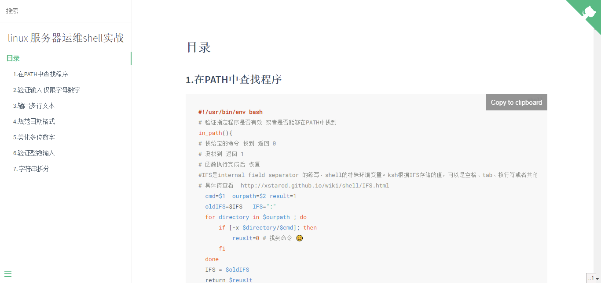

# cleverShell

> 《linux 服务器运维shell实战》

## 版本 2.2

[ 在线文档](https://xiaomiwujiecao.github.io/cleverShell)

## 目录
### 基础
[基础](./tutorail/README.md)
### 正文
[第一章 遗失的代码库](./chapter1/README.md)
### 拓展
[nodeJS生产环境部署](./nodejs/README.md)

